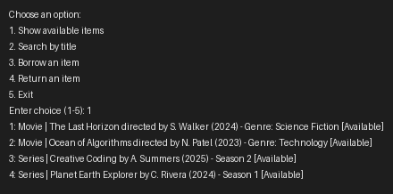

# Student Media Rental OOP Project

This is a Python project built to demonstrate Object-Oriented Programming (OOP) concepts.

## Project Overview

The project models a simple media rental store where students can browse and borrow items such as movies and series.

## OOP Concepts Used

- **Classes and Objects**: `MediaItem`, `Movie`, `Series`, and `MediaStore` are classes used to create objects.
- **Encapsulation**: Data fields are stored as private or protected members (`_title`, `_author`, `_available`) and accessed via public methods/properties.
- **Abstraction**: `MediaItem` is an abstract base class defining common behavior for all media items.
- **Inheritance**: `Movie` and `Series` inherit from `MediaItem`.
- **Polymorphism**: The `get_description` method is implemented differently by `Movie` and `Series`, allowing each item to describe itself appropriately.

## Files

- `media_item.py` - Abstract base class and common media item behavior.
- `movie.py` - `Movie` class that inherits from `MediaItem`.
- `series.py` - `Series` class that inherits from `MediaItem`.
- `media_store.py` - `MediaStore` class and demo store builder.
- `media_store_app.py` - Main program containing the command-line interface.
- `README.md` - Project explanation and usage instructions.

## How to Run

1. Make sure you have Python installed (version 3.8 or newer).
2. Open a terminal in the project folder.
3. Run the project:

```bash
py media_store_app.py
```

## Project Features

- Add and manage media items.
- Search items by title.
- Borrow and return items.
- Clear console interface for student interaction.

## Example Use

- View currently available movies and series.
- Search by title keyword like `Ocean` or `Coding`.
- Borrow an item by ID.
- Return an item by ID.

## Sample Session



```text
Choose an option:
1. Show available items
2. Search by title
3. Borrow an item
4. Return an item
5. Exit
Enter choice (1-5): 1
1: Movie | The Last Horizon directed by S. Walker (2024) - Genre: Science Fiction [Available]
2: Movie | Ocean of Algorithms directed by N. Patel (2023) - Genre: Technology [Available]
3: Series | Creative Coding by A. Summers (2025) - Season 2 [Available]
4: Series | Planet Earth Explorer by C. Rivera (2024) - Season 1 [Available]
```

## Notes

This project was created to satisfy an OOP school assignment and clearly demonstrates functions, classes and objects, encapsulation, abstraction, inheritance, and polymorphism.
